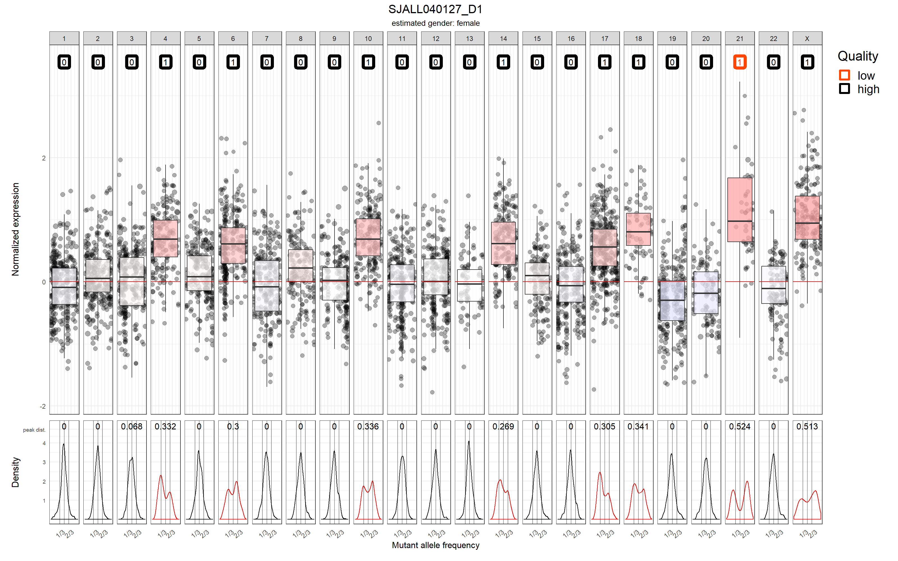
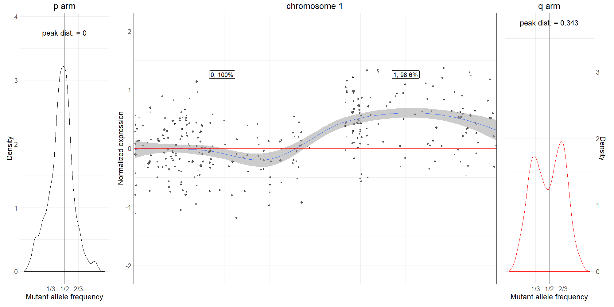
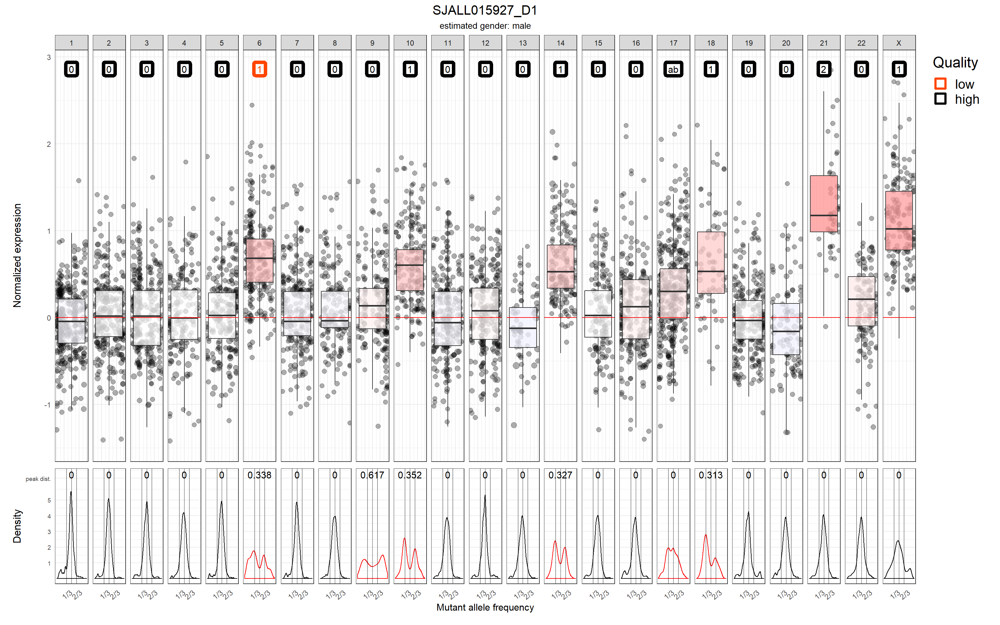
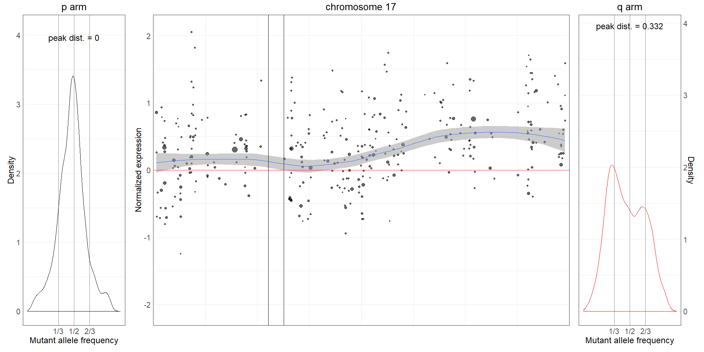
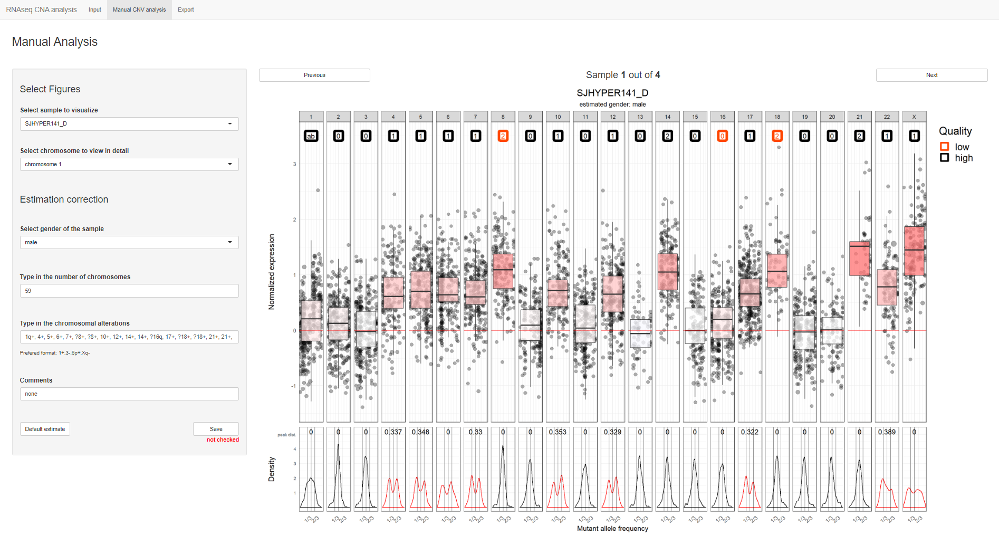

# RNAseqCNV

### An R package for analysis of copy number variations (CNV) from RNA-seq data
This R package is for analysis, visualization and automatic estimation of large-scale (chromosomoal and arm-level) CNVs from RNA-seq data. Users can use either a wrapper function or a Shiny app to generate CNV figures and automatically estimate CNVs on each chromosome. The Shiny app also serves as an interface to view and double-check the predicted CNV results.

### Table of contents
1.[Installation](#installation)<br/>

2.[Functionality](#functionality)<br/>

&nbsp;&nbsp;&nbsp;&nbsp;&nbsp;&nbsp;1.[Input](#input)<br/>

&nbsp;&nbsp;&nbsp;&nbsp;&nbsp;&nbsp;&nbsp;&nbsp;&nbsp;&nbsp;&nbsp;&nbsp;1.[Config](#config)<br/>

&nbsp;&nbsp;&nbsp;&nbsp;&nbsp;&nbsp;&nbsp;&nbsp;&nbsp;&nbsp;&nbsp;&nbsp;2.[Metadata](#metadata)<br/>

&nbsp;&nbsp;&nbsp;&nbsp;&nbsp;&nbsp;&nbsp;&nbsp;&nbsp;&nbsp;&nbsp;&nbsp;3.[Count files](#count_files)<br/>

&nbsp;&nbsp;&nbsp;&nbsp;&nbsp;&nbsp;&nbsp;&nbsp;&nbsp;&nbsp;&nbsp;&nbsp;4.[SNV information](#snv_files)<br/>

&nbsp;&nbsp;&nbsp;&nbsp;&nbsp;&nbsp;&nbsp;&nbsp;&nbsp;&nbsp;&nbsp;&nbsp;&nbsp;&nbsp;&nbsp;&nbsp;&nbsp;&nbsp;1.[VCF](#vcf)<br/>

&nbsp;&nbsp;&nbsp;&nbsp;&nbsp;&nbsp;&nbsp;&nbsp;&nbsp;&nbsp;&nbsp;&nbsp;&nbsp;&nbsp;&nbsp;&nbsp;&nbsp;&nbsp;2.[Custom tabular data](#custom_table)<br/>

&nbsp;&nbsp;&nbsp;&nbsp;&nbsp;&nbsp;&nbsp;&nbsp;&nbsp;&nbsp;&nbsp;&nbsp;5.[Basic function parameters](#basic_params)<br/>

&nbsp;&nbsp;&nbsp;&nbsp;&nbsp;&nbsp;&nbsp;&nbsp;&nbsp;&nbsp;&nbsp;&nbsp;&nbsp;&nbsp;&nbsp;&nbsp;&nbsp;&nbsp;1.[Arm-level figures](#arm_level_figures_param)<br/>

&nbsp;&nbsp;&nbsp;&nbsp;&nbsp;&nbsp;&nbsp;&nbsp;&nbsp;&nbsp;&nbsp;&nbsp;&nbsp;&nbsp;&nbsp;&nbsp;&nbsp;&nbsp;2.[Estimation labels](#estimation_labels)<br/>

&nbsp;&nbsp;&nbsp;&nbsp;&nbsp;&nbsp;&nbsp;&nbsp;&nbsp;&nbsp;&nbsp;&nbsp;&nbsp;&nbsp;&nbsp;&nbsp;&nbsp;&nbsp;3.[Diploid adjustment](#diploid_adjustment)<br/>

&nbsp;&nbsp;&nbsp;&nbsp;&nbsp;&nbsp;2.[Output](#output)<br/>

&nbsp;&nbsp;&nbsp;&nbsp;&nbsp;&nbsp;&nbsp;&nbsp;&nbsp;&nbsp;&nbsp;&nbsp;1.[Main figure](#main_figure)<br/>

&nbsp;&nbsp;&nbsp;&nbsp;&nbsp;&nbsp;&nbsp;&nbsp;&nbsp;&nbsp;&nbsp;&nbsp;2.[Arm level figure](#arm_level_figure)<br/>

&nbsp;&nbsp;&nbsp;&nbsp;&nbsp;&nbsp;&nbsp;&nbsp;&nbsp;&nbsp;&nbsp;&nbsp;3.[Estimation table](#estimation_table)<br/>

3.[Output interpretation example](#output_interpretation_example)<br/>

4.[Shiny app](#shiny_app)<br/>

&nbsp;&nbsp;&nbsp;&nbsp;&nbsp;&nbsp;1.[Input tab](#input_tab)<br/>

&nbsp;&nbsp;&nbsp;&nbsp;&nbsp;&nbsp;&nbsp;&nbsp;&nbsp;&nbsp;&nbsp;&nbsp;1.[Mock analysis](#mock_analysis)<br/>

&nbsp;&nbsp;&nbsp;&nbsp;&nbsp;&nbsp;2.[Manual analysis tab](#manual_analysis_tab)<br/>

&nbsp;&nbsp;&nbsp;&nbsp;&nbsp;&nbsp;3.[Export tab](#export_tab)<br/>


###  1. Installation <a name="installation"></a>
Users must have [R](https://www.r-project.org/) installed. [Rstudio](https://rstudio.com/products/rstudio/) is optional but recommended IDE.

To download RNAseqCNV package from GitHub, it is convenient to use the package devtools, namely function: install_github. The package installation can take a few minutes.
```
# install devtools
install.packages("devtools")

# install RNAseqCNV package
devtools::install_github(repo = "honzee/RNAseqCNV")
```

### 2. Functionality <a name="functionality"></a>
The results are generated either by a wrapper function: RNAseqCNV_wrapper() or through a shiny app which is deployed by the launchApp() function. The RNAseqCNV_wrapper() provides more flexibility in terms of function parameters. The app on the other hand enables easier browsing and checking of the results. 

```
# Examples of basic function calls:
library(RNAseqCNV)

# example of wrapper function (DO NOT RUN) 
RNAseqCNV_wrapper(config = "path/to/config", metadata = "path/to/metadata", snv_format = "vcf")

# launch the shiny app with:
launchApp()
```

#### 2.1. Input <a name="input"></a>
Both the wrapper and the shiny app receive the same required input. Per-gene read count and SNV minor allele frequency (MAF) and depth are used to produce the results. Therefore, two types of files are needed for each sample.

To use the wrapper or analyze samples inside the shiny application, path to **config file** and **metadata file** in correct formats need to be provided.

##### 2.1.1 Config <a name="config"></a>
Config parameter expects a path to an R script as its argument. This R script defines paths to the input directories for both count files and files with snv information and also to the output directory. The names of variables inside the script must be identical as those in the example below:
```
out_dir = "/Path/to/output_dir"
count_dir = "/Path/to/dir/with/count_files"
snv_dir = "/Path/to/dir/with/vcf_files"

```

##### 2.1.2 Metadata <a name="metadata"></a>
Metadata parameter expects a path to a file with comma/tab/space separated table with three columns. The first column contains sample names, the second countains count file names and the third contains vcf/custom table file names. **The table cannot have a header and the order of these columns must be kept as in the example below:**

|[]()|||
|--- | --- | ---|
|SJALL014946_D1 | SJALL014946_D1.HTSeq | SJALL014946_D1.vcf|
|SJALL014949_D1 | SJALL014949_D1.HTSeq | SJALL014949_D1.vcf|
|SJALL014950_D1 | SJALL014950_D1.HTSeq | SJALL014950_D1.vcf|

##### 2.1.3 Count files <a name="count_files"></a>

An output of HTSeq or similar read counting software. The table must have two columns: first column with ensembl gene ids and second column with read count. The table should not have a header.

| []() |    |
|-----------------|-----|
| ENSG00000000005 | 0   |
| ENSG00000000419 | 94  |
| ENSG00000000457 | 128 |
| ENSG00000000460 | 133 |
| ENSG00000000938 | 171 |
| ENSG00000000971 | 5   |

##### 2.1.4 SNV information <a name="snv_files"></a>

Either vcf file or custom tabular data are accepted.

###### 2.1.4.1 VCF <a name="vcf"></a>

VCF files with correct format can be acquired by running [GATK pipeline](https://gatk.broadinstitute.org/hc/en-us/articles/360035531192-RNAseq-short-variant-discovery-SNPs-Indels-).

| #CHROM | POS   | ID | REF | ALT | QUAL   | FILTER | INFO                                                                                                                                                                              | FORMAT         | sample_name           |
|-------|-------|----|-----|-----|--------|--------|-----------------------------------------------------------------------------------------------------------------------------------------------------------------------------------|----------------|--------------------------|
| 1     | 14792 | .  | G   | A   | 156.77 | .      | AC=1;AF=0.500;AN=2;BaseQRankSum=-1.442;ClippingRankSum=0.000;DP=27;ExcessHet=3.0103;FS=1.690;MLEAC=1;MLEAF=0.500;MQ=60.00;MQRankSum=0.000;QD=5.81;ReadPosRankSum=-0.169;SOR=1.124 | GT:AD:DP:GQ:PL | 0/1:19,8:27:99:185,0,644 |
| 1     | 14907 | .  | A   | G   | 126.77 | .      | AC=1;AF=0.500;AN=2;BaseQRankSum=-0.015;ClippingRankSum=0.000;DP=10;ExcessHet=3.0103;FS=2.808;MLEAC=1;MLEAF=0.500;MQ=60.00;MQRankSum=0.000;QD=14.09;ReadPosRankSum=0.751;SOR=1.170 | GT:AD:DP:GQ:PL | 0/1:3,6:9:64:155,0,64    |
| 1     | 14930 | .  | A   | G   | 161.77 | .      | AC=1;AF=0.500;AN=2;BaseQRankSum=0.751;ClippingRankSum=0.000;DP=10;ExcessHet=3.0103;FS=2.808;MLEAC=1;MLEAF=0.500;MQ=60.00;MQRankSum=0.000;QD=17.97;ReadPosRankSum=2.515;SOR=1.170  | GT:AD:DP:GQ:PL | 0/1:3,6:9:64:190,0,64    |

###### 2.1.4.2 Custom tabular data <a name="custom_table"></a>
The table has four required columns: <br/>
- chr: chromosome the SNV is located on
- start: locus of the SNV
- depth: read depth for this locus
- maf: minor allele frequency, can be calculated as depth for alternative (minor) allele divided by overall read depth of the locus.<br/>
The header names have to respect the format below:

| chr | start | depth | maf    |
|-----|-------|-------|--------|
| 1   | 14599 | 40    | 0.5   |
| 1   | 14604 | 9    | 0.3333   |
| 1   | 14610 | 10   | 0.25 |

##### 2.1.5 Basic function parameters <a name="basic_params"></a>

Explanation of basic wrapper function parameters and shiny app options.

###### 2.1.5.1 Arm-level figures <a name="arm_level_figures_param"></a>
The plotting of arm-level figures increases the per-sample runtime significantly. You can disable the this by:
```
RNAseqCNV_wrapper(config = "path/to/config", metadata = "path/to/metadata", snv_format = "vcf", arm_lvl = FALSE)
```
or uncheck the appropriate box in the shiny app interface.

###### 2.1.5.2 Estimation labels <a name="estimation_labels"></a>
The estimation labels can be removed from the figures with:
```
RNAseqCNV_wrapper(config = "path/to/config", metadata = "path/to/metadata", snv_format = "vcf", estimate_lab = FALSE)
```
or by unchecking the appropriate box in the shiny app interface.

###### 2.1.5.3 Diploid adjustment <a name="diploid_adjustment"></a>
Some samples may include high proportion of chromosomes with CNVs, such as the one below:


With regard to the relative nature of RNA-seq data, in such samples the normalized expression of stably expressed genes on diploid chromosomes will not be centered around zero. To address this issue, the package includes a random forest model, which classifies chromosomes as either diploid or non-diploid. Based on that information the figure is centered in a way that the chromosomes, which are estimated as diploid, are centered around zero:


This functionality is by default turned on. To disable it:
```
RNAseqCNV_wrapper(config = "path/to/config", metadata = "path/to/metadata", snv_format = "vcf", adjust = FALSE)
```
or uncheck the appropriate box in the shiny app interface.


#### 2.2 Output <a name="output"></a>
The output (figures and tables) of both wrapper and the shiny app will be saved in the output directory as specified in the config file.

##### 2.2.1 Main figure <a name="main_figure"></a>



The main figure consists of two panels.

The upper panel shows the visualization of per-chromosom expression level. Y axis shows log2 fold change of expression against reference samples, x axis is divided into 23 separete facets, on each for chromosomes from 1-X (chromosome Y purpousely excluded) and the position along the x axis represents the position of genes on a chromosome. For each chromosome a weighted boxplot is drawn based upon the distribution of normalized expression of genes on that chromosome. The median expression value of a chromosome is also represented by the color of a boxplot on scale from blue (low median of expression), white (median expression around 0) to red(high median of expression). For each chromosome a pair of random forrest models estimates the copy number. This estimation can be seen in the upper part of each facet. The red colour of this estimation label signifies lower confidence (quality) of CNV call. 

The bottom panel shows the density graphs of MAF for each chromosome. It is important to note that only MAF values in the interval from 0.05 to 0.9 were kept, since the SNVs with values out of this range are not helpful in determining CNVs. In the upper part of each density graph there is also a peak distance number. It is the distance on x axis between two highest peaks in the density graph. This can help in distinguishing between CNVs and also copy neutral loss of heterozygozity (LOH).

##### 2.2.2 Arm-level figures <a name="arm_level_figure"></a>



Users have the option to generate close up figures of each chromosome with either

```
RNAseqCNV_wrapper(config = "path/to/config", metadata = "path/to/metadata", snv_format = "vcf", arm_lvl = TRUE)
```
or ticking the appropriate box in the shiny app interface.

The large panel in the middle is a close up of the main figure, specific for one chromosome. In the upper part in addition to the random forest estimated alteration, there is also the percentage of trees in the model that agreed upon this alteration. On both sides of this panel, there are two MAF density graphs, one for p arm and one for q arm. For chromosomes without p arm there is only one side panel on the left.

##### 2.2.3 Estimation table <a name="estimation_table"></a>
The estimated gender, arm-level alterations and chromosome number are saved in two tables in the output directory. The estimation_table.tsv is meant to store the output of RNAseqCNV models. The manual_an_table.tsv stores the corrections made by users inside the shiny app.

- sample: sample name as in the metadata table
- gender: gender as estimated with respect to the expression of genes on chromosome Y
- chrom_n: final number of whole chromosomes in the samples (only high quality, whole chromosome CNVs are taken into account)
- alterations: alterations as estimated by random forest model. Gain is marked by a "+" sign, loss by "-" sign, double gain (and higher) by two identical alterations with "+" sign. P and q letters specify the arm, where the CNV occurs. ? signifies lower confidence of the classification judged by the percentage of trees that voted for this alteration, these calls should be checked manually by the user.

| sample         | gender | chrom_n | alterations                                                                                 |
|----------------|--------|---------|---------------------------------------------------------------------------------------------|
| SJHYPER141_D   | male   | 59      | 1q+, 4+, 5+, 6+, 7+, ?8+, ?8+, 10+, 12+, 14+, 14+, ?16q, 17+, ?18+, ?18+, 21+, 21+, 22+, X+ |
| SJALL015971_D1 | female | 28      | 1-, 2-, 3-, 4-, 5-, 7-, 8-, 9-, 11-, 12-, 13-, 14-, 15-, 16-, 17-, 19-, 20-, 22-            |
| SJALL049672_D1 | male   | 34      | 2-, 3-, 4-, 5-, 7-, 9-, 13-, 15-, 16-, 17-, 20-, ?21, 22-                                   |
| SJALL015927_D1 | female | 52      | ?6p+, 6q+, 10+, 14+, 17q+, 18+, 21+, 21+, X+                                                |

### 3. Output interpretation example <a name="output_intrepretation_example"></a>

Both panels of the main figure are important for discerning large-scale CNVs. By combining the expression level information and MAF density graphs it is possible to estimate CNVs with higher accuracy. The list below represents only a few basic patterns of CNVs and the results will largely depend on the type of sample the user will be working with.

The figure below will serve as an example for result interpretation.



- diploid chromosomes: 1, 2, 3, 4, 5, 7, 8, 11, 12, 13, 15, 16, 19, 20, 22. The expression should be centered around zero (especially if diploid level adjustment was performed). The density graphs have a clear, high peak around 0.5 as would be expected with two chromosomes with two different alleles. SNVs with MAF outside the range 0.05 to 0.9 are filtered since these are mostly unifnormative.

- copy neutral loss of heterozygozity: 9. The expression level is roughly on the level of other diploid chromosomes, which would suggest two copies, however, after inspection of MAF density graph we can see, that this is not the whole story. The shape of the density graph would suggest that there is only on chromosome copy, since the peaks are so wide apart. This pattern is consistent with LOH.

- single gain: 6, 10, 14, 18. The expression is significantly higher than for diploid chromosomes. At the same time, the MAF density graph suggests ratio of alleles 2:1/1:2, which is typical for single gain.

- double gain: 21. The expression is usually even higher than in chromosomes with single gain. However, for double gains, the MAF graphs can have two patterns according to the ratio of alleles in the sample (3:1, 2:2). In this case the peak is centered around 0.5 since the two additional copies come from different chromosomes (one maternal, one paternal).

- chromosome X: Estimation of CNVs on chromosome X is more problematic, since due to X inactivation in women MAF graphs are usually uninformative. However, we can at least roughly approximate whether a gain or loss of X chromosome has occured by the expression level. In this case the higher expression suggests a gain of at least one copy.

- partial gain/loss: The expression level level of partial gain/deletion is somewhere in between the diploid chromosomes and chromosomes with whole chromosomal change. The MAF density graph is distorted, but not in a typical pattern. Partial changes are marked as "ab" in the main figure which can lead us to further examination of this chromosome in the arm-level figure:



In this case, it is clear, that there is at least partial gain on q arm of chromosome 17.


- deletion: 1, 2, 3, 4, 5, 7, 8, 9, 11, 12, 13, 14, 15, 16, 17, 19, 20, 22. The deletions have significantly lower expression in comparison to diploid chromosomes. Also the MAF density graph suggests, that there is only a single allele. However, the deletion of chromosome 17 is not complete since there is still small but visible peak around 0.5.

### 4. Shiny app <a name="shiny_app"></a>

The shiny app enables CNV analysis similar to the RNAseqCNV_wrapper. Moreover, it help user to browse easier through the results and providers an interface for manual checking and correction of the CNVs called by the package. It is launched by:
```
launchApp()
```
#### 4.1 Input tab <a name="input_tab"></a>


The shiny app needs a metadata file and a config file to function. If both files are suplied and the analysis has not yet been performed the users can analyse either only the first sample or analyze all of the samples from the metadata table. In case that the analysis with this metadata file and config file was already perfomed (either through RNAseqCNV_wrapper or with the app during earlier instance), the two other tabs (Manual CNV analysis and Export) will be shown.

Users can tweak the arguments [(mentioned earlier)](#basic_params) for the analysis through check boxes and radio buttons.

##### 4.1.1 Mock analysis <a name="mock_analysis"></a>
In case the user wants to test the app and the package as a whole, there is an option to perform mock analysis on in-built dat. It can be run without any input (even without config and metadata). The results will be stored in the directory selected by the user after clicking the button "Mock analysis". The Manual analysis tab and Export tab will be shown after the in-built samples are analyzed.

#### 4.2 Manual analysis tab <a name="manual_analysis_tab"></a>


In this tab, users can browse through the analyzed samples and arm-level figures (if generated). The user can correct the results manually and add comments. After the corrections are completed "Save" button should be clicked in order to save the changes into the manual analysis table in the output directory. In case the user wants to revert the changes back to the default as produced by the analysis, button "Default analysis" can be clicked to achieve this.

#### 4.3 Export <a name="export_tab"></a>


The tab enables to customize the estimation table by selecting the desired columns to be kept. This table can be subsequently saved into a directory, which is chosen after clicking the "Export to selected directory" button.
